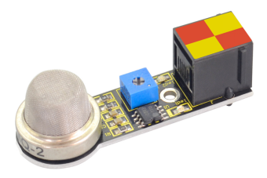
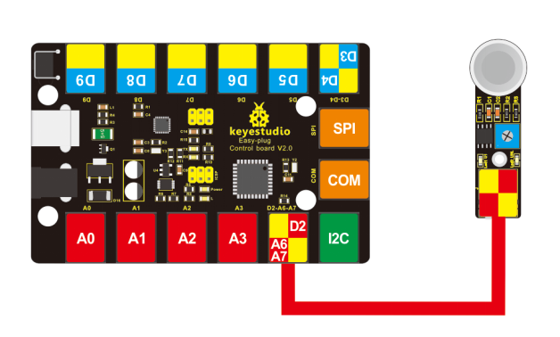
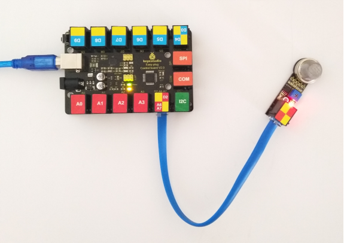
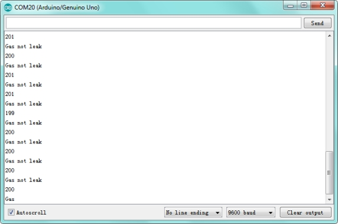

# KS0131 keyestudio EASY plug Analog Gas Sensor



## 1. Introduction

This analog gas sensor - MQ2 is used in gas leakage detecting equipment in consumer electronics and industrial markets.

This sensor is suitable for detecting LPG, I-butane, propane, methane, alcohol, Hydrogen and smoke. It has high sensitivity and quick response.

In addition, the sensitivity can be adjusted by the potentiometer. This module should be used together with EASY plug control board.

**Special Note:**

The sensor/module is equipped with the RJ11 6P6C interface, compatible with our keyestudio EASY plug Control Board with RJ11 6P6C interface.

If you have the control board of other brands, it is also equipped with the RJ11 6P6C interface but has different internal line sequence, can’t be used compatibly with our sensor/module.

## 2. Features

- Connector: Easy plug
- Power supply: 5V
- Interface type: Digital and Analog
- Wide detecting scope
- Simple drive circuit
- Stable and long lifespan
- Quick response and High sensitivity

## 3. Technical Details

- Dimensions: 56mm * 20mm * 18mm
- Weight: 9g

## 4. Connect It Up

Connect the EASY Plug analog gas sensor to control board using an RJ11 cable. Then connect the control board to your PC with a USB cable.



## 5. Upload the Code

Download code:  [Code](./Code.7z)

```c
int gas_din=2;
int gas_ain=A7;
int led=13;
int ad_value;

void setup()
{
  pinMode(led,OUTPUT);
  pinMode(gas_din,INPUT);
  pinMode(gas_ain,INPUT);
  Serial.begin(9600);
}

void loop()
{ 
  ad_value=analogRead(gas_ain);
  if(digitalRead(gas_din)==LOW)
  { 
    digitalWrite(led,HIGH);
    Serial.println("Gas leakage");
    Serial.println(ad_value);
  }
  else
  {
    digitalWrite(led,LOW);
    Serial.println("Gas not leak");
    Serial.println(ad_value);
  }
  delay(500);
}
```

## 6. Result

Done uploading the test code, open the serial monitor and set the baud rate to 9600, you should be able to see the “Gas not leak” and analog value.



